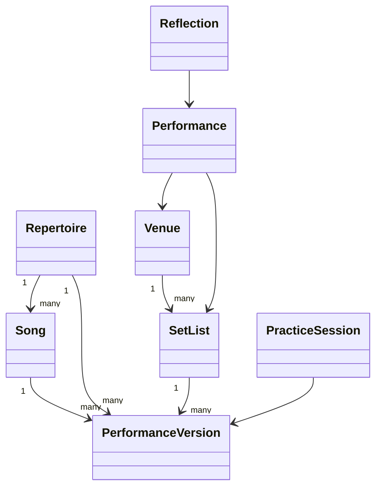

# Architecture

## Package responsibilities

- `open_mic_lab.domain`: immutable or explicitly managed dataclass models and validation.
- `open_mic_lab.services`: deterministic calculations that answer educational questions.
- `open_mic_lab.sample_data`: repeatable examples for chapters, CLI demos, and tests.
- `open_mic_lab.cli`: terminal access to the current laboratories.

## Relationships

## Why `Song` and `PerformanceVersion` are separate

`Song` describes the composition: title, artist, original key, tempo, genre, mood, and audience affordances. `PerformanceVersion` describes how a specific musician currently performs it: chosen key, target tempo, instrument, difficulty, confidence ratings, introduction length, status, and notes. This separation makes experiments safe: a learner can compare a lowered-key version with an original-key version without rewriting the song.

## Services vs. domain objects

Domain objects protect invariants. Services interpret those objects for a learning purpose. Readiness scoring and set-list analysis are isolated so future chapters can replace formulas without redesigning the core model.

## Future extension points

Persistence, analytics, MIDI, audio, notebooks, dashboards, and AI can be added as adapters around the stable domain model. They should depend on domain objects rather than forcing domain objects to depend on databases, notebooks, or external APIs.

## Deterministic behavior

Sample data, readiness calculations, and set-list analysis avoid randomness and network calls. This keeps textbook examples, tests, and CLI output reproducible.

## Validation philosophy

Validation errors should be clear enough for learners to fix their data: blank identifiers, non-positive tempos, negative durations, duplicate set-list entries, and out-of-range 0-10 ratings are rejected early.

## Educational limitations

The system compares choices; it does not measure artistic worth, predict audience response, or guarantee a successful performance.
