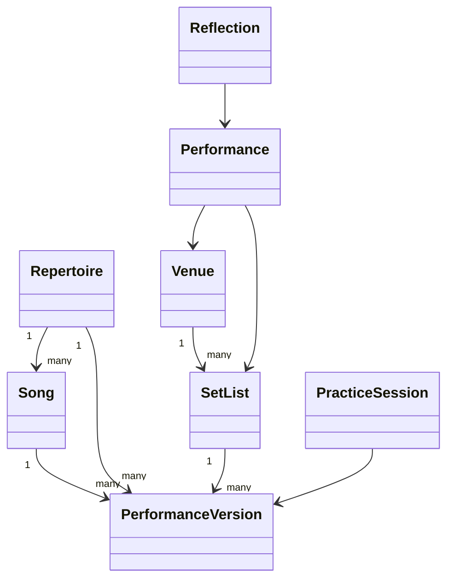
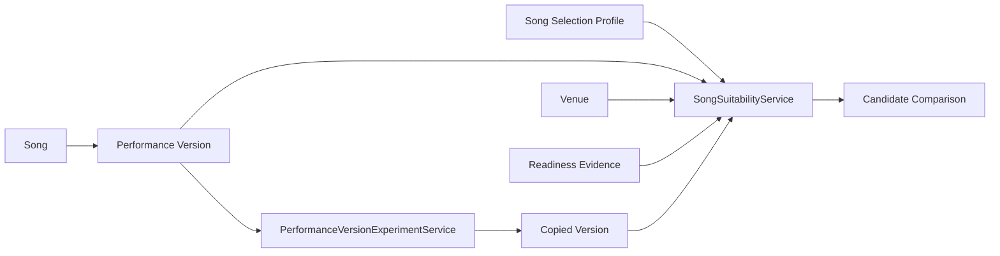

# Architecture

## Package responsibilities

- `open_mic_lab.domain`: immutable or explicitly managed dataclass models and validation.
- `open_mic_lab.services`: deterministic calculations that answer educational questions.
- `open_mic_lab.sample_data`: repeatable examples for chapters, CLI demos, and tests.
- `open_mic_lab.cli`: terminal access to the current laboratories.

## Relationships

## Why `Song` and `PerformanceVersion` are separate

`Song` describes the composition: title, artist, original key, tempo, genre, mood, and audience affordances. `PerformanceVersion` describes how a specific musician currently performs it: chosen key, target tempo, instrument, difficulty, confidence ratings, introduction length, status, and notes. This separation makes experiments safe: a learner can compare a lowered-key version with an original-key version without rewriting the song.

## Services vs. domain objects

Domain objects protect invariants. Services interpret those objects for a learning purpose. Readiness scoring and set-list analysis are isolated so future chapters can replace formulas without redesigning the core model.

## Future extension points

Persistence, analytics, MIDI, audio, notebooks, dashboards, and AI can be added as adapters around the stable domain model. They should depend on domain objects rather than forcing domain objects to depend on databases, notebooks, or external APIs.

## Deterministic behavior

Sample data, readiness calculations, and set-list analysis avoid randomness and network calls. This keeps textbook examples, tests, and CLI output reproducible.

## Validation philosophy

Validation errors should be clear enough for learners to fix their data: blank identifiers, non-positive tempos, negative durations, duplicate set-list entries, and out-of-range 0-10 ratings are rejected early.

## Educational limitations

The system compares choices; it does not measure artistic worth, predict audience response, or guarantee a successful performance.

## Chapter 1 song-selection architecture

Chapter 1 introduces `SongSelectionProfile` as the profile for a particular performance opportunity: performer experience, comfortable vocal range, instrument preferences, desired energy and role, venue identifier, hard limits, and criterion weights. It represents the question being asked, not a permanent judgment about a song.

`VocalNote` and `VocalRange` provide a small standard-library pitch model. Notes such as `C3`, `F#3`, and `Bb4` are validated and converted to deterministic pitch numbers. Enharmonic spellings compare by pitch number while preserving display spelling. A required song range can be compared with a performer comfort range and transposed by semitone intervals.

`SongSuitabilityService` owns suitability scoring. Domain objects store facts and learner-supplied ratings; scoring, concerns, explanations, confidence/completeness, and adaptation suggestions remain in the service layer so formulas can change without mutating the artistic domain model.

Hard constraints are visible separately from soft preferences. Current hard constraints include unavailable versions, unavailable required instruments, missing venue piano for piano-led arrangements, duration exceeding the whole slot, and non-negotiable vocal limits. Soft preferences include mood, energy, audience familiarity, storytelling, role, flexibility, and personal motivation.

`PerformanceVersionExperimentService` creates copied performance versions for transposition and simplification. Experiments do not mutate the source object because learners need to compare “before” and “after” deliberately. The transposition experiment shifts the required vocal range by the same interval; the simplification experiment lowers difficulty and uses bounded projected stability and energy assumptions.

Chapter 1 prepares for Chapter 2 repertoire engineering by making candidate fit explicit before introducing larger repertoire collections, persistence, or optimization. The design intentionally avoids a full database, GUI, audio analysis, or advanced set-list optimizer at this stage.
