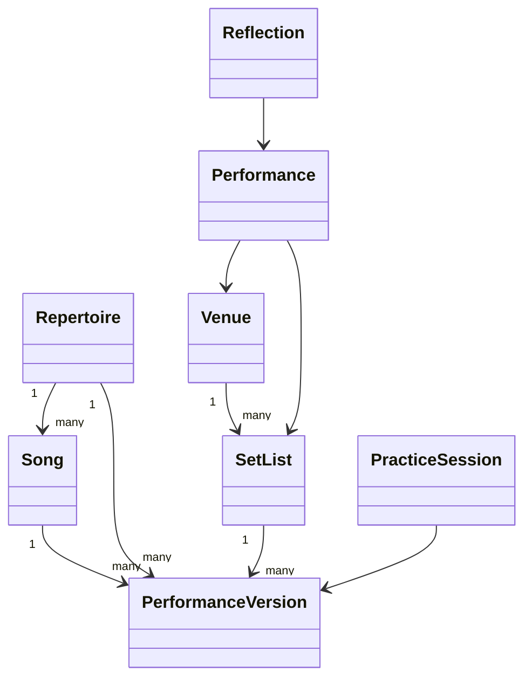
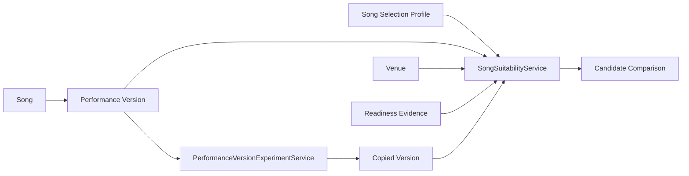
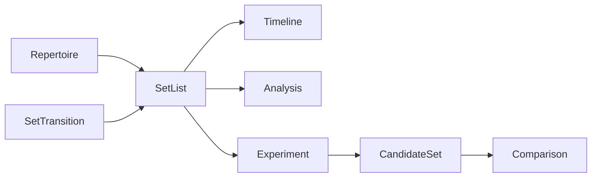
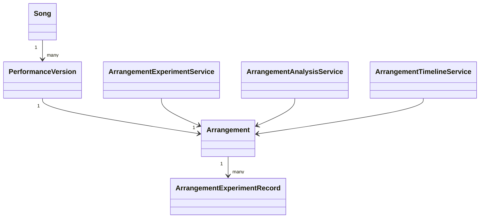
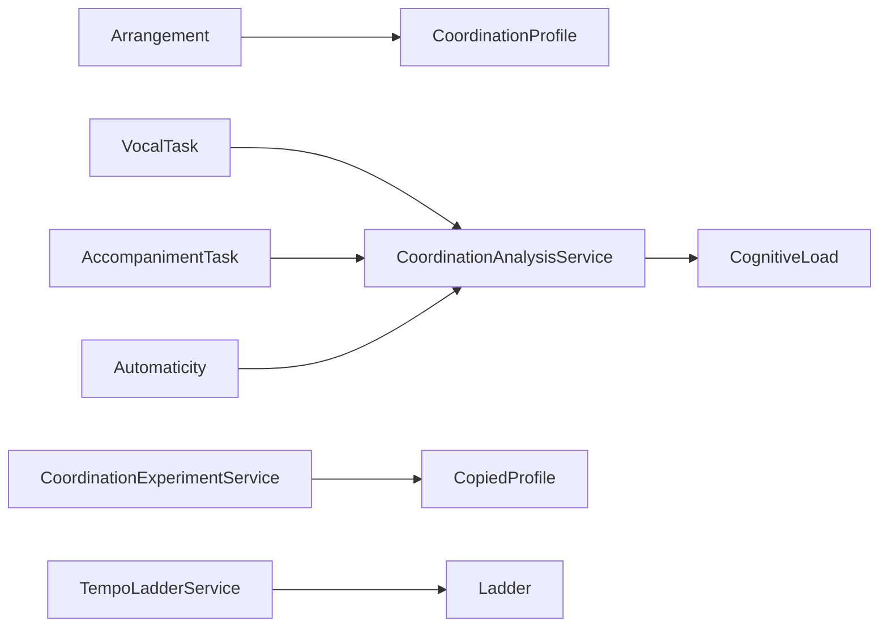
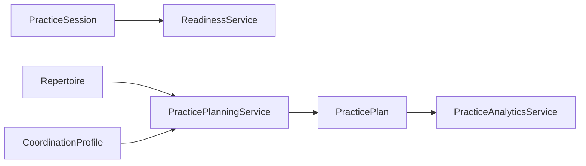

# Architecture

## Package responsibilities

- `open_mic_lab.domain`: immutable or explicitly managed dataclass models and validation.
- `open_mic_lab.services`: deterministic calculations that answer educational questions.
- `open_mic_lab.sample_data`: repeatable examples for chapters, CLI demos, and tests.
- `open_mic_lab.cli`: terminal access to the current laboratories.

## Relationships

## Why `Song` and `PerformanceVersion` are separate

`Song` describes the composition: title, artist, original key, tempo, genre, mood, and audience affordances. `PerformanceVersion` describes how a specific musician currently performs it: chosen key, target tempo, instrument, difficulty, confidence ratings, introduction length, status, and notes. This separation makes experiments safe: a learner can compare a lowered-key version with an original-key version without rewriting the song.

## Services vs. domain objects

Domain objects protect invariants. Services interpret those objects for a learning purpose. Readiness scoring and set-list analysis are isolated so future chapters can replace formulas without redesigning the core model.

## Future extension points

Persistence, analytics, MIDI, audio, notebooks, dashboards, and AI can be added as adapters around the stable domain model. They should depend on domain objects rather than forcing domain objects to depend on databases, notebooks, or external APIs.

## Deterministic behavior

Sample data, readiness calculations, and set-list analysis avoid randomness and network calls. This keeps textbook examples, tests, and CLI output reproducible.

## Validation philosophy

Validation errors should be clear enough for learners to fix their data: blank identifiers, non-positive tempos, negative durations, duplicate set-list entries, and out-of-range 0-10 ratings are rejected early.

## Educational limitations

The system compares choices; it does not measure artistic worth, predict audience response, or guarantee a successful performance.

## Chapter 1 song-selection architecture

Chapter 1 introduces `SongSelectionProfile` as the profile for a particular performance opportunity: performer experience, comfortable vocal range, instrument preferences, desired energy and role, venue identifier, hard limits, and criterion weights. It represents the question being asked, not a permanent judgment about a song.

`VocalNote` and `VocalRange` provide a small standard-library pitch model. Notes such as `C3`, `F#3`, and `Bb4` are validated and converted to deterministic pitch numbers. Enharmonic spellings compare by pitch number while preserving display spelling. A required song range can be compared with a performer comfort range and transposed by semitone intervals.

`SongSuitabilityService` owns suitability scoring. Domain objects store facts and learner-supplied ratings; scoring, concerns, explanations, confidence/completeness, and adaptation suggestions remain in the service layer so formulas can change without mutating the artistic domain model.

Hard constraints are visible separately from soft preferences. Current hard constraints include unavailable versions, unavailable required instruments, missing venue piano for piano-led arrangements, duration exceeding the whole slot, and non-negotiable vocal limits. Soft preferences include mood, energy, audience familiarity, storytelling, role, flexibility, and personal motivation.

`PerformanceVersionExperimentService` creates copied performance versions for transposition and simplification. Experiments do not mutate the source object because learners need to compare “before” and “after” deliberately. The transposition experiment shifts the required vocal range by the same interval; the simplification experiment lowers difficulty and uses bounded projected stability and energy assumptions.

Chapter 1 prepares for Chapter 2 repertoire engineering by making candidate fit explicit before introducing larger repertoire collections, persistence, or optimization. The design intentionally avoids a full database, GUI, audio analysis, or advanced set-list optimizer at this stage.

## Chapter 2 repertoire engineering

Repertoire is now a first-class aggregate around `Song` and `PerformanceVersion`. A performance version has exactly one lifecycle status and may carry repertoire metadata: dates, maintenance interval, practice/performance totals, audience-response totals, target readiness, preferred venues, setup requirements, preferred role, confidence, and notes. `RepertoireEngineeringService` computes deterministic distributions, observations, gap recommendations, learning priorities, text reports, and the health score formula: 25% diversity, 20% maintenance, 25% readiness, 15% balance, and 15% role coverage. The score is educational comparison data, not a musicianship grade.

## Chapter 3 set-building architecture

Chapter 3 adds first-class `SetTransition` objects and `SetBuilderService`. `SetList` remains focused on sequencing: ordered performance-version identifiers, target venue and duration, and planned transitions. Song facts and arrangement facts remain on `Song` and `PerformanceVersion`; the set model does not duplicate duration, key, instrument, mood, or readiness data.

`SetBuilderService` creates deterministic timelines by walking opening transitions, songs, and after-song transitions in order. The same service analyzes total duration, venue fit, energy progression, mood balance, genre diversity, key repetition, instrument changes, audience familiarity, original-versus-cover balance, transition timing, opener suitability, and closer suitability. Results contain observations, warnings, strengths, and suggested experiments rather than a single perfect score.

Set experiments are immutable: swap, remove, replace, insert transition, shorten transition, change opener, change closer, reorder by energy, and manual reorder all return copied set lists. This preserves the original candidate set so learners can compare before and after.

Chapter 3 prepares for Chapter 4 arrangement experiments by making the whole performance flow visible before changing the internal arrangement of individual songs.

## Chapter 4 arrangement architecture

Chapter 4 adds `Arrangement` as a dedicated domain object. `Song` remains the fixed work; `PerformanceVersion` remains the learner's prepared version and readiness state; `Arrangement` describes the intentional musical design for that version. The split prevents arrangement fields from overwhelming `PerformanceVersion` and lets one song support original piano, simplified piano, guitar, lower-key, coffeehouse, and audience-participation arrangements.

`ArrangementExperimentService` provides immutable operations: transpose, simplify accompaniment, alter tempo, shorten introduction, extend ending, remove section, duplicate chorus, change groove, switch primary instrument, and combine. Each operation returns a copied `Arrangement` and appends an `ArrangementExperimentRecord` that names the source arrangement and summarizes the change.

`ArrangementAnalysisService` compares arrangements by explaining differences and tradeoffs rather than selecting a winner. `ArrangementTimelineService` turns structure and tempo into deterministic timing estimates. The lifecycle is: create baseline arrangement, copy through experiments, compare stages, inspect history, then choose the version that best serves the performance context.

Chapter 4 prepares Chapter 5 by establishing that intentional arrangement choices can be observed, discussed, and revised before being tested with an audience.

## Chapter 5 coordination architecture

Chapter 5 adds a coordination model for singing while playing. `CoordinationProfile` composes a `VocalTask`, an `AccompanimentTask`, and `Automaticity` rather than scattering calculations through CLI commands or demos. `CoordinationAnalysisService` owns the deterministic educational formula and returns a `CognitiveLoad`, coordination score, bottlenecks, practice focus, and factor explanations. The service explicitly describes the result as an educational model, not a measurement of neurological ability.

`CoordinationExperimentService` follows the existing immutable experiment pattern from performance versions, set lists, and arrangements. Simplifying accompaniment, reducing tempo, isolating rhythm, practicing lyrics only, practicing accompaniment only, combining voice with accompaniment, and raising tempo gradually all return copied profiles with experiment history. `TempoLadderService` generates deterministic gradual BPM sequences.

Chapter 5 builds on Chapter 4 arrangements by asking how arrangement complexity affects attention. It prepares Chapter 6 deliberate-practice engineering by turning bottlenecks into repeatable experiments.

## Chapter 6 practice engineering architecture

Chapter 6 adds `PracticeGoal`, `PracticeTask`, `PracticeBlock`, `PracticePlan`, `SkillArea`, `PracticePriority`, and `PracticeOutcome` beside the existing `PracticeSession` evidence model. These objects describe designed practice without duplicating song, arrangement, readiness, or coordination facts.

`PracticePlanningService` converts readiness gaps, repertoire maintenance pressure, coordination bottlenecks, learner priorities, and available minutes into an ordered immutable `PracticePlan`. `PracticeAnalyticsService` summarizes distribution, neglected skills, over-practiced skills, readiness trends, and educational observations.

Chapter 6 prepares Chapter 7 by ensuring the learner has a transparent practice plan before studying stage presence.
