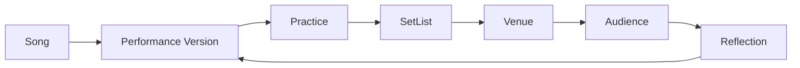

# Chapter 0: Why Perform?


## Research Foundations

**Research Finding:** This chapter is informed by work on live performance, audience relationship, preparation, and reflective music learning. **Professional Practice:** It translates those traditions into open-mic decisions that performers and facilitators commonly make. **Educational Heuristic:** Any score, warning, category, or recommendation produced by the laboratory is a repository-designed simplification for comparison and reflection, not a validated predictive model. **Subjective Artistic Judgment:** Learners may reasonably override the model when identity, taste, occasion, or audience relationship matters more than numerical fit.
## Learning objectives

- Explain why live performance differs from private practice.
- Describe the performer-audience relationship as a system.
- Distinguish accuracy from connection.
- Compare a `Song` with a `PerformanceVersion`.
- Use experimentation as the central learning method.

## Narrative introduction

Private practice can be paused, repeated, and judged only by the musician. Live performance unfolds in shared time. The audience changes the room: attention, familiarity, noise, laughter, silence, and participation all become part of the musical event.

Accuracy matters, but accuracy and connection are not identical. A careful performance can fail to invite the room in; an imperfect performance can still communicate clearly if recovery, story, pacing, and presence are strong.



## Guided code example

```python
from open_mic_lab.sample_data import build_sample_repertoire, sample_practice_sessions
from open_mic_lab.services.readiness_service import calculate_readiness

repertoire = build_sample_repertoire()
original = repertoire.get_version("river-guitar-original")
lowered = repertoire.get_version("river-guitar-lowered")

print(calculate_readiness(original).score)
print(calculate_readiness(lowered, sample_practice_sessions()).breakdown)
```

## Executable laboratory

Run:

```bash
python -m open_mic_lab.cli readiness show river-guitar-original
python -m open_mic_lab.cli readiness show river-guitar-lowered
```

Compare the same song in original key and tempo with a lowered, slower version. Inspect which readiness breakdown lines changed. Ask: did the change improve vocal comfort, simplify recovery, reduce energy, or alter the story?

## Reflection questions

1. What changes when a song leaves private practice and enters a room with listeners?
2. Which rating feels most subjective: memory, vocal comfort, accompaniment, or recovery?
3. What is one experiment you could run before your next open mic?
4. How might a longer introduction help or hurt connection?

## Chapter summary

Performance is a system of repertoire choices, preparation, venue constraints, audience relationship, and reflection. This repository is educational and non-predictive: it helps compare experiments, not certify artistic value or guarantee outcomes.

## Debug Laboratory

The executable laboratory runs complete readiness commands. The debug laboratory is different: it lets you pause a small, learner-owned scenario and inspect how one changed performance version alters readiness.

Use the VS Code launch configuration **Debug Chapter 0 Readiness Lab**, or run the same helper from the repository root:

```bash
python -m open_mic_lab.debug_labs.chapter_00_readiness
```

Recommended breakpoint markers are in `src/open_mic_lab/debug_labs/chapter_00_readiness.py`:

1. `BREAKPOINT: Inspect the song, original version, adapted version, and practice evidence.`
2. `BREAKPOINT: Step Into the real readiness calculation for the original version.`
3. `BREAKPOINT: Step Into the real readiness calculation for the adapted version.`
4. `BREAKPOINT: Inspect the two structured breakdowns before comparing scores.`

Inspect these variables: `song`, `original_version`, `adapted_version`, `practice_sessions`, `readiness_inputs`, `original_result`, `adapted_result`, `original_breakdown`, `adapted_breakdown`, and `score_difference`.

Suggested sequence:

1. Start **Debug Chapter 0 Readiness Lab**.
2. Stop at the first marker and Step Over the tuple assignment so the inputs are visible.
3. Step Into `calculate_readiness` for the original version and watch the weighted skill values become a base score.
4. Step Out, then Step Into the adapted version calculation.
5. Step Over the breakdown assignments and compare the two structured results.
6. Continue to the concise terminal summary.

Questions to answer:

- Which values enter the readiness calculation?
- Which factor contributes most strongly?
- Does changing the key directly alter every readiness factor?
- Which values are measured practice evidence, and which are scenario assumptions on the version?
- Why does the service return a structured breakdown instead of only a score?

Reset by stopping the debugger and launching the same configuration again. The helper rebuilds deterministic sample data each time, so learner experiments can be repeated from a known baseline.

Expected conceptual finding: the adapted version is not a magic prediction. It changes explicit version fields such as key, tempo, difficulty, vocal comfort, accompaniment stability, memory, and recovery assumptions; the readiness service then combines those values with matching practice evidence into a transparent result.

## References and Further Reading

For the full APA bibliography, see [References](../references.md). Suggested starting points for this chapter: Williamon (2004), Small (1998), Lehmann et al. (2007), and Hattie and Timperley (2007). These sources motivate the educational concepts; they do not validate the exact deterministic scores used here.
