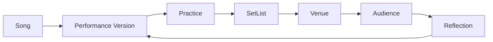

# Chapter 0: Why Perform?

## Learning objectives

- Explain why live performance differs from private practice.
- Describe the performer-audience relationship as a system.
- Distinguish accuracy from connection.
- Compare a `Song` with a `PerformanceVersion`.
- Use experimentation as the central learning method.

## Narrative introduction

Private practice can be paused, repeated, and judged only by the musician. Live performance unfolds in shared time. The audience changes the room: attention, familiarity, noise, laughter, silence, and participation all become part of the musical event.

Accuracy matters, but accuracy and connection are not identical. A careful performance can fail to invite the room in; an imperfect performance can still communicate clearly if recovery, story, pacing, and presence are strong.



## Guided code example

```python
from open_mic_lab.sample_data import build_sample_repertoire, sample_practice_sessions
from open_mic_lab.services.readiness_service import calculate_readiness

repertoire = build_sample_repertoire()
original = repertoire.get_version("river-guitar-original")
lowered = repertoire.get_version("river-guitar-lowered")

print(calculate_readiness(original).score)
print(calculate_readiness(lowered, sample_practice_sessions()).breakdown)
```

## Executable laboratory

Run:

```bash
python -m open_mic_lab.cli readiness show river-guitar-original
python -m open_mic_lab.cli readiness show river-guitar-lowered
```

Compare the same song in original key and tempo with a lowered, slower version. Inspect which readiness breakdown lines changed. Ask: did the change improve vocal comfort, simplify recovery, reduce energy, or alter the story?

## Reflection questions

1. What changes when a song leaves private practice and enters a room with listeners?
2. Which rating feels most subjective: memory, vocal comfort, accompaniment, or recovery?
3. What is one experiment you could run before your next open mic?
4. How might a longer introduction help or hurt connection?

## Chapter summary

Performance is a system of repertoire choices, preparation, venue constraints, audience relationship, and reflection. This repository is educational and non-predictive: it helps compare experiments, not certify artistic value or guarantee outcomes.
