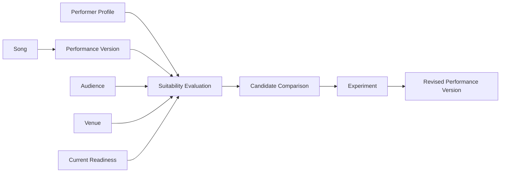

# Chapter 1 — Choosing Songs

## Learning objectives

By the end of the chapter, the learner should be able to explain why personal taste alone does not determine performance suitability; distinguish a song from a performer-specific version; identify hard constraints and soft preferences; evaluate vocal, technical, emotional, audience, and venue fit; interpret a transparent suitability score; compare songs without treating the ranking as artistic truth; test adaptations such as transposition and simplification; and select a song deliberately for a specific performance opportunity.

## Narrative introduction

Musicians often choose songs because they love the recording, the song is impressive, friends know it, it showcases technique, or it feels emotionally meaningful. Each reason can be valuable, but none alone guarantees that the song will work in the room.

A performance song is not just a composition. It is a relationship among the song, performer, arrangement, venue, audience, and moment.



## Laboratory

Evaluate one song:

```bash
open-mic-lab songs evaluate harbor-guitar --scenario coffeehouse
```

Compare candidates:

```bash
open-mic-lab songs compare --scenario coffeehouse
open-mic-lab songs compare --scenario listening-room
```

Identify a hard constraint by comparing piano songs in a guitar-only scenario, then examine missing information through the completeness percentage:

```bash
open-mic-lab songs explain lantern-piano --scenario first-performance
```

Transpose and simplify in Python:

```python
from open_mic_lab.sample_data import build_sample_repertoire, sample_selection_scenarios, sample_selection_venue
from open_mic_lab.services.experiment_service import PerformanceVersionExperimentService
from open_mic_lab.services.suitability_service import SongSuitabilityService

rep = build_sample_repertoire()
profile = sample_selection_scenarios()["coffeehouse"]
venue = sample_selection_venue(profile.venue_identifier)
version = rep.get_version("window-guitar-original-feature")
experiments = PerformanceVersionExperimentService()
lowered = experiments.transpose(version, "F", -2)
simplified = experiments.simplify(version)
service = SongSuitabilityService()
print(service.evaluate(version, rep, profile, venue).score)
print(service.evaluate(lowered, rep, profile, venue).score)
print(service.evaluate(simplified, rep, profile, venue).score)
```

Compare the revised version with the original, interpret tradeoffs, and choose a candidate by explaining why its strengths matter for this opportunity. The laboratory can show that a familiar audience favorite scores differently from a personally meaningful original, but it cannot decide your artistic intention.

## Reflection questions

- Which song do you enjoy practicing most?
- Which song feels safest?
- Which song best introduces you to an unfamiliar audience?
- Which song creates the strongest emotional connection?
- Which weaknesses could be adapted rather than accepted?
- What information does the laboratory not know about you?
- Would you choose the highest-scoring song? Why or why not?
- What would you change before performing the song?

## Limitations

Scores do not measure artistic quality. Audience familiarity is contextual and subjective. Vocal range does not measure vocal tone, fatigue, or healthy technique. Adaptation estimates are educational scenarios. Personal connection cannot be fully represented numerically. A surprising artistic choice may work even when a model considers it risky.

## Chapter summary

Choose songs for a particular performer, audience, venue, and moment—not in the abstract.
