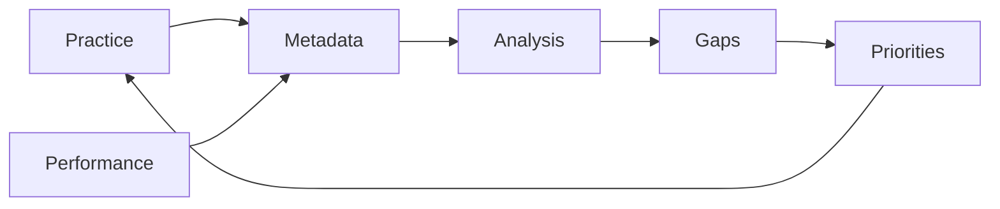
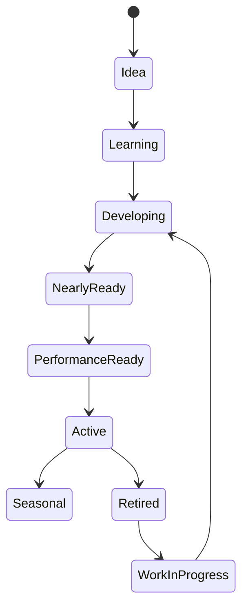

# Chapter 2 — Repertoire Engineering


## Research Foundations

**Research Finding:** This chapter is informed by work on repertoire management, practice planning, expertise development, and self-regulated learning. **Professional Practice:** It translates those traditions into open-mic decisions that performers and facilitators commonly make. **Educational Heuristic:** Any score, warning, category, or recommendation produced by the laboratory is a repository-designed simplification for comparison and reflection, not a validated predictive model. **Subjective Artistic Judgment:** Learners may reasonably override the model when identity, taste, occasion, or audience relationship matters more than numerical fit.
## Learning objectives

- Treat repertoire as a living system, not a list.
- Explain the lifecycle from learning to active, seasonal, work-in-progress, original, and retired repertoire.
- Analyze diversity, maintenance, readiness, role coverage, and gaps.
- Use deterministic recommendations to decide what to practice or revive next.

## Narrative

Every practice session changes the repertoire. Every performance changes it again. Chapter 0 introduced performance as a system; Chapter 1 showed that song choice is contextual. Chapter 2 asks: **what is my repertoire trying to become?**



## Engineering mindset

A repertoire is decision support. It should answer: what is balanced, what is neglected, what is nearly ready, what role is missing, and what category would make the next performance more flexible?

## Repertoire lifecycle

Each `PerformanceVersion` belongs to exactly one `PerformanceStatus`: idea, learning, developing, nearly ready, performance ready, active repertoire, seasonal repertoire, original repertoire, work in progress, or retired repertoire. These are workflow labels, not artistic judgments.



## Metadata explanation

Chapter 2 adds dates, maintenance interval, practice and performance totals, audience-response count, target readiness, preferred venues, setup needs, preferred role, average confidence, and notes. Current readiness remains calculated by the readiness engine to avoid duplicate data.

## Diversity and maintenance

Diversity is estimated from genre, key, mood, instrument, and role spread. Maintenance compares `last_practiced` with `maintenance_interval_days`; a stalled song is one that has exceeded its interval.

## Gap analysis

The gap engine recommends categories, never copyrighted songs: opener, closer, upbeat material, audience participation, originals, guitar repertoire, low-difficulty safety songs, and advanced challenge songs.

## Learning priorities

The priority heuristic rewards versions that are nearly ready, neglected, genre-diversifying, instrument-diversifying, role-filling, and venue-appropriate. Retired songs are downweighted so revival is intentional.

## Repertoire health formula

Health = 25% diversity + 20% maintenance + 25% readiness + 15% balance + 15% role coverage. This is an educational comparison, not an objective measure of musicianship.

## Executable laboratory

```bash
open-mic-lab repertoire summary
open-mic-lab repertoire gaps
open-mic-lab repertoire health
open-mic-lab repertoire priorities
open-mic-lab chapter-two-demo
```

## Debug laboratory

Run:

```bash
python -m open_mic_lab.debug_labs.chapter_02_repertoire_engineering
```

Break at the documented markers to inspect repertoire loading, analysis, gap detection, priority scoring, and health scoring.

## Reflection questions

- Which role is your repertoire missing?
- Which genre or key appears too often?
- Which song has stalled because it is hard, boring, or unclear in purpose?
- Which retired song deserves revival?
- What should the repertoire become by Chapter 3?

## Chapter summary

Repertoire engineering turns song collection into a feedback system for better choices, healthier maintenance, and more intentional performances.

## References and Further Reading

For the full APA bibliography, see [References](../references.md). Suggested starting points for this chapter: Hallam (1997), McPherson and Zimmerman (2002), Zimmerman (2002), and Ericsson et al. (1993). These sources motivate the educational concepts; they do not validate the exact deterministic scores used here.
