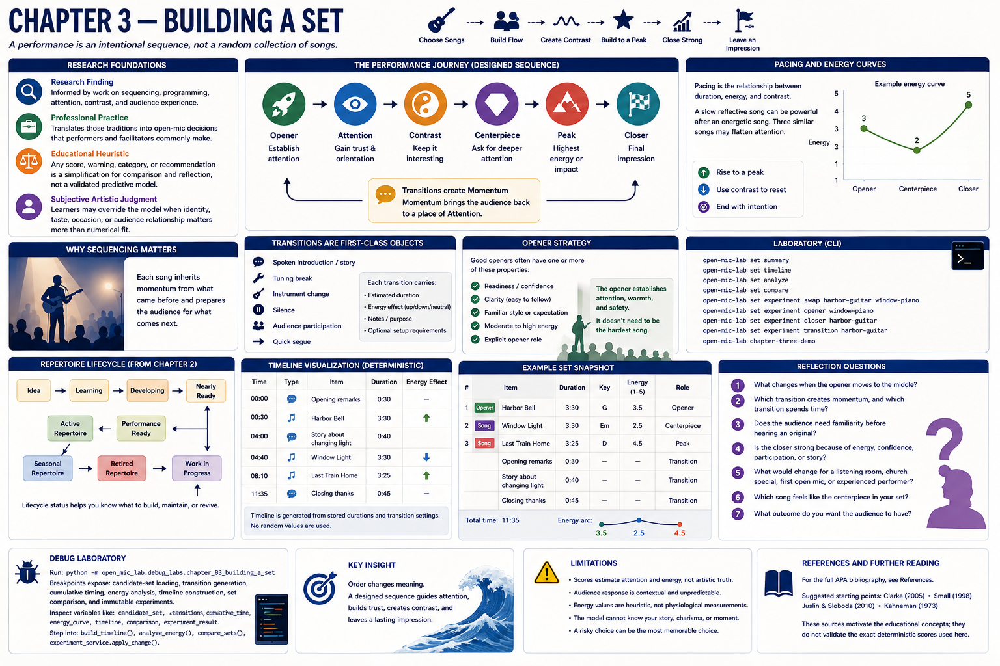
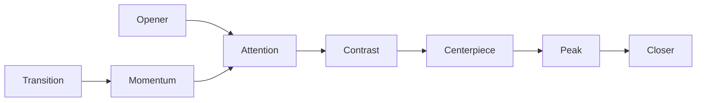

# Chapter 3 — Building a Set



## Research Foundations

**Research Finding:** This chapter is informed by work on sequencing, programming, attention, contrast, and audience experience. **Professional Practice:** It translates those traditions into open-mic decisions that performers and facilitators commonly make. **Educational Heuristic:** Any score, warning, category, or recommendation produced by the laboratory is a repository-designed simplification for comparison and reflection, not a validated predictive model. **Subjective Artistic Judgment:** Learners may reasonably override the model when identity, taste, occasion, or audience relationship matters more than numerical fit.
## Learning objectives

- Explain why a performance is an intentional sequence, not a random collection of songs.
- Predict how opener, transitions, contrast, pacing, and closer change audience attention.
- Generate and read a deterministic performance timeline.
- Compare candidate sets without declaring a single objectively correct winner.
- Use immutable experiments to ask: **What happens if I change the order?**

## Why sequencing matters

A strong song can still land poorly if it arrives at the wrong moment. Chapter 3 treats the set list as a designed system: each song inherits momentum from what came before and prepares the audience for what comes next.



## Audience attention

The opener gives listeners their first evidence about tempo, confidence, warmth, and safety. Early-set songs should keep the room oriented. A centerpiece can ask for deeper attention once trust has been established.

## Pacing and energy curves

Pacing is the relationship between duration, energy, and contrast. A slow reflective song can be powerful after an energetic song, but three similar reflective songs may flatten attention. The laboratory displays energy progression so learners can see the curve rather than guessing.

```mermaid
xychart-beta
    title "Example energy curve"
    x-axis [Opener, Centerpiece, Closer]
    y-axis "Energy" 1 --> 5
    line [3, 2, 5]
```

## Transitions

Transitions are first-class objects. A transition can be a spoken introduction, story, tuning break, instrument change, silence, audience participation moment, or quick segue. Each carries estimated duration, energy effect, notes, and optional setup requirements.

## Opener strategy

Good openers often have one or more of these properties: readiness, clarity, familiar style, moderate-to-high energy, or an explicit opener role. The opener does not need to be the hardest song; it needs to establish attention.

## Closer strategy

A closer is the final impression. It may be the energy peak, the most confident song, the most participatory song, or an encore-ready song. Replacing the closer is one of the fastest ways to hear how order affects the entire set.

## Timeline visualization

The timeline is generated from opening transitions, song durations stored on `PerformanceVersion`, and transitions after songs. No random values are used.

```text
00:00  Opening remarks
00:30  Harbor Bell
04:00  Story about changing light
04:40  Window Light
08:10  Last Train Home
11:35  Closing thanks
```

## Executable laboratory

```bash
open-mic-lab set summary
open-mic-lab set timeline
open-mic-lab set analyze
open-mic-lab set compare
open-mic-lab set experiment swap harbor-guitar window-piano
open-mic-lab set experiment opener window-piano
open-mic-lab set experiment closer harbor-guitar
open-mic-lab set experiment transition harbor-guitar
open-mic-lab chapter-three-demo
```

## Debug laboratory

Run:

```bash
python -m open_mic_lab.debug_labs.chapter_03_building_a_set
```

Breakpoint markers expose candidate-set loading, transition generation, cumulative timing, energy analysis, timeline construction, set comparison, and immutable experiments.

## Reflection questions

- What changes when the opener moves to the middle?
- Which transition creates momentum, and which transition spends time?
- Does the audience need familiarity before hearing an original?
- Is the closer strong because of energy, confidence, participation, or story?
- What would change for a listening room, church special, first open mic, or experienced performer?

## Chapter summary

Set construction builds on repertoire engineering by turning individual prepared songs into a planned audience journey. Chapter 4 can now explore arrangement experiments because Chapter 3 has made sequence, timing, and flow visible.

## References and Further Reading

For the full APA bibliography, see [References](../references.md). Suggested starting points for this chapter: Clarke (2005), Small (1998), Juslin and Sloboda (2010), and Kahneman (1973). These sources motivate the educational concepts; they do not validate the exact deterministic scores used here.
