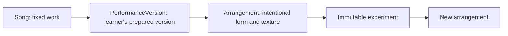
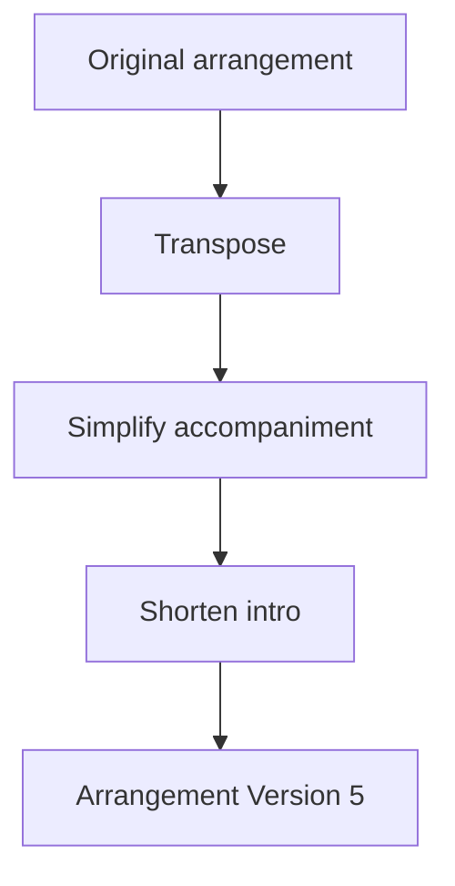

# Chapter 4 — Making Songs Your Own

## Learning objectives

- Explain why performers play **their version** of a song rather than reproduce a recording.
- Distinguish `Song`, `PerformanceVersion`, and `Arrangement` responsibilities.
- Use immutable arrangement experiments to ask: **What happens if I change the arrangement?**
- Compare arrangement tradeoffs without declaring a universal winner.
- Read a deterministic structural timeline for an arrangement.
- Debug arrangement creation, copying, chaining, comparison, timing, and history.

## Why arrangements matter

A song is the fixed musical work: title, artist, original key, tempo, genre, mood, and audience affordances. An arrangement is the intentional performance design: key, tempo, instrument, groove, form, dynamics, cues, and simplification choices. Separating them protects the song while letting the performer adapt the performance.



## Performance versions vs arrangements

`PerformanceVersion` still owns readiness-facing preparation facts such as status, confidence, availability, estimated duration, and repertoire metadata. `Arrangement` owns structural and musical design choices: primary/supporting instruments, key, tempo, groove, introduction, ending, order of sections, chorus repetitions, bridge usage, solos, participation cues, simplification level, dynamics, notes, and experiment history.

This separation keeps Chapter 0–3 services stable while Chapter 4 adds more detailed musical experimentation.

## Experimentation mindset

Every arrangement decision is an experiment:

- transpose;
- simplify accompaniment;
- alter tempo;
- shorten an introduction;
- extend an ending;
- remove a section;
- duplicate a chorus;
- change groove;
- switch primary instrument;
- combine several steps.

The question is not “Which version is objectively best?” The question is “Which version better serves this performer, room, audience, and moment?”

## Immutable experimentation

Experiments return new arrangements. The source arrangement remains available for comparison.



The final arrangement carries history records so the learner can explain how it evolved.

## Arrangement comparison

Comparison reports differences and tradeoffs. For example:

- piano/original key/original tempo preserves familiar muscle memory;
- guitar/lower key/slower tempo may improve vocal comfort but adds setup and practice needs;
- simplified piano/short intro/sing-along ending may free attention for communication while reducing harmonic detail.

## Timeline diagrams

The structural timeline is deterministic. It estimates durations from tempo and section type so repeated runs produce the same outline.

```text
Intro
Verse 1
Chorus
Verse 2
Bridge
Instrumental
Final Chorus
Extended Ending
```



```mermaid
gantt
    title Arrangement outline
    dateFormat X
    axisFormat %S
    Intro :0, 20
    Verse 1 :20, 27
    Chorus :47, 27
    Verse 2 :74, 27
    Bridge :101, 22
    Final Chorus :123, 27
    Extended Ending :150, 20
```

## Executable laboratory

```bash
open-mic-lab arrangement list
open-mic-lab arrangement compare
open-mic-lab arrangement analyze
open-mic-lab arrangement experiment transpose window-piano-arrangement G -2
open-mic-lab arrangement experiment simplify window-piano-arrangement
open-mic-lab arrangement experiment tempo window-piano-arrangement 64
open-mic-lab arrangement experiment groove window-piano-arrangement coffeehouse
open-mic-lab arrangement history
open-mic-lab chapter-four-demo
```

## Debug laboratory

Run:

```bash
python -m open_mic_lab.debug_labs.chapter_04_arrangements
```

Breakpoint markers expose arrangement creation, source version relationship, immutable copying, experiment chaining, comparison, timeline generation, and experiment history.

## Reflection questions

- What changed musically when the key changed?
- What did simplification make easier, and what did it cost?
- Does a slower tempo increase expression or reduce energy?
- Which audience participation cue feels inviting rather than forced?
- Which version would you choose for a first open mic, a cafe, or a listening room?

## Chapter summary

A song is fixed. A performance version evolves. An arrangement is how that evolution becomes intentional. Chapter 5 can build on this by connecting arrangement choices to live audience interaction and post-performance reflection.
