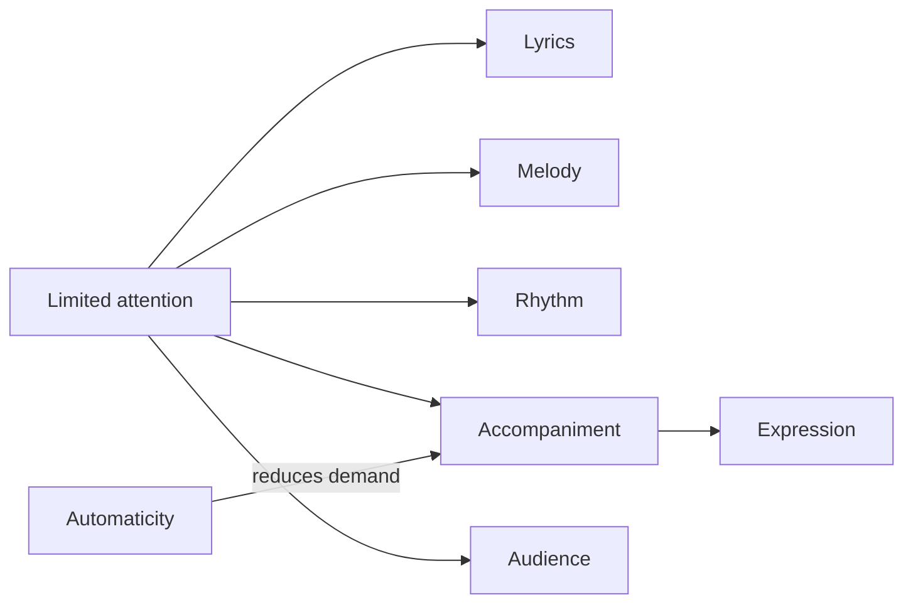
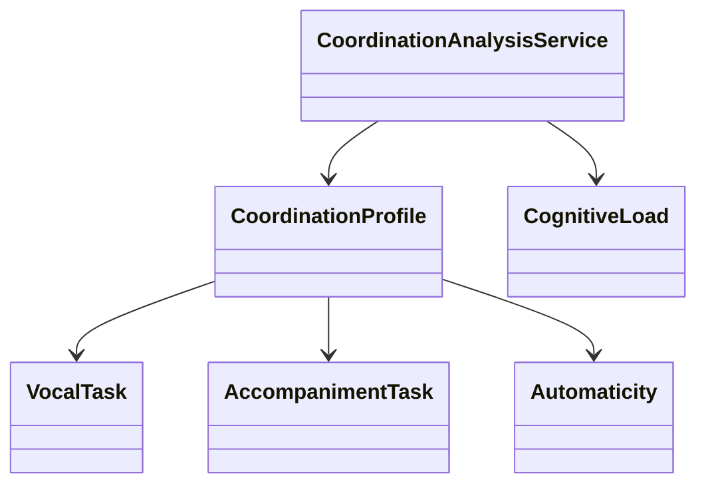

# Chapter 5 — Singing While Playing

## Learning objectives

- Explain why lyrics, melody, rhythm, accompaniment, tempo, dynamics, listening, movement, and audience awareness compete for limited attention.
- Use `CoordinationProfile`, `VocalTask`, `AccompanimentTask`, `Automaticity`, and `CognitiveLoad` to describe the system.
- Generate tempo ladders and compare immutable practice experiments.
- Identify bottlenecks without treating coordination as a mysterious talent.

## Cognitive load and automaticity

Singing while playing is difficult because the performer is not doing one task. The performer is coordinating several tasks under time pressure. When accompaniment becomes automatic, it needs less conscious monitoring, which frees attention for words, phrasing, recovery, and audience connection.



## Coordination model

The coordination engine is deterministic and educational. It returns a coordination score, cognitive-load estimate, bottlenecks, suggested practice focus, and contributing-factor explanations. It does not measure neurological ability.



## Deliberate practice experiments

Immutable experiments make safe comparisons:

- simplify accompaniment
- reduce tempo
- isolate rhythm
- practice lyrics only
- practice accompaniment only
- combine voice and accompaniment
- increase tempo gradually

Each experiment copies the profile and records its source. The original remains available for before/after reasoning.

## Tempo ladders

A tempo ladder might be `60, 66, 72, 78, 84, 90 BPM`. Gradual increases are often more effective than jumping to performance tempo because they preserve coordination success while adding only one new pressure at a time.

## Bottleneck analysis

Likely limiting factors include left-hand independence, lyric memory, chord transitions, rhythm consistency, breathing, and accompaniment complexity. The point is not blame; the point is choosing the next experiment.

## Executable laboratory

Try:

```bash
open-mic-lab coordination analyze
open-mic-lab coordination bottlenecks
open-mic-lab coordination ladder
open-mic-lab coordination experiment simplify
open-mic-lab coordination experiment tempo 60
open-mic-lab chapter-five-demo
```

## Debug laboratory

Run:

```bash
python -m open_mic_lab.debug_labs.chapter_05_coordination
```

Set breakpoints around coordination-score calculation, tempo ladder generation, bottleneck identification, practice experiment effects, and immutable experiment copies.

## Reflection questions

- Which task fails first when attention is crowded?
- What could become automatic before the next full-speed run?
- Would simplifying accompaniment make the performance less interesting, or more communicative?
- Which bottleneck deserves one isolated experiment today?

## Chapter summary

Performance skill emerges from systematic reduction of cognitive load. Singing while playing improves when the learner turns vague difficulty into visible tasks, chooses a bottleneck, runs a small experiment, and lets automaticity grow deliberately.
