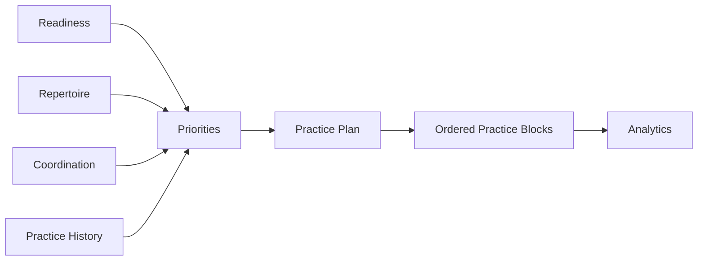
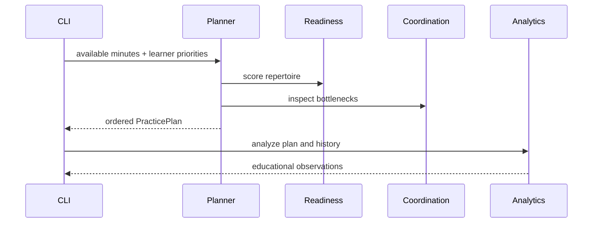

# Chapter 6 — Deliberate Practice Engineering


## Research Foundations

**Research Finding:** This chapter is informed by work on deliberate practice, feedback, metacognition, goal setting, and self-regulated learning. **Professional Practice:** It translates those traditions into open-mic decisions that performers and facilitators commonly make. **Educational Heuristic:** Any score, warning, category, or recommendation produced by the laboratory is a repository-designed simplification for comparison and reflection, not a validated predictive model. **Subjective Artistic Judgment:** Learners may reasonably override the model when identity, taste, occasion, or audience relationship matters more than numerical fit.
## Learning objectives

By the end of this chapter, the learner can generate a structured practice session, explain why each block was chosen, compare practice strategies, and distinguish deliberate practice from repeatedly playing songs.

## Deliberate practice principles

Practice is an investment. The laboratory treats each minute as a choice among maintenance, focused improvement, recovery, and performance preparation. It does not predict mastery; it makes assumptions visible.



## Diminishing returns and stopping

The engine favors short focused blocks because repetitions become less informative when fatigue rises. A success criterion is attached to every block so the learner knows when to stop or move on.

## Practice planning

The plan answers: **What practice plan will produce the greatest improvement?** Inputs include available time, readiness gaps, coordination bottlenecks, maintenance pressure, learner priorities, and upcoming-performance goals.

## Maintenance vs improvement

Maintenance blocks protect songs that are already useful. Improvement blocks target a specific weakness. A neglected performance-ready song may need a run-through; a developing song may need tempo ladder or isolated coordination.

## Practice blocks

Supported block types include warm-up, rhythm isolation, accompaniment only, lyrics only, coordination, arrangement refinement, tempo ladder, performance run-through, cooldown, and reflection.



## Analytics

Analytics summarizes time allocation, neglected skills, over-practiced skills, and recent readiness evidence. Observations are educational prompts, not judgments.

## Executable laboratory

```bash
open-mic-lab practice plan
open-mic-lab practice analyze
open-mic-lab practice priorities
open-mic-lab practice blocks
open-mic-lab practice experiment maintenance
open-mic-lab practice experiment performance
open-mic-lab chapter-six-demo
```

## Debug laboratory

Run:

```bash
python -m open_mic_lab.debug_labs.chapter_06_practice_engineering
```

Set breakpoints at markers for priority calculation, plan generation, block sequencing, immutable experiments, and analytics observations.

## Reflection questions

- Which block would produce the greatest improvement per minute today?
- Which skill needs maintenance rather than aggressive improvement?
- Which repetition should stop because the signal has become fatigue?
- What should become automatic before the next full performance run?

## Chapter summary

Chapter 6 turns practice into a transparent planning system. Readiness, repertoire, arrangements, and coordination now feed deliberate practice recommendations. Chapter 7 can build on this by asking how prepared material becomes stage presence in front of people.

## References and Further Reading

For the full APA bibliography, see [References](../references.md). Suggested starting points for this chapter: Ericsson et al. (1993), Macnamara et al. (2014), Zimmerman (2002), McPherson and Zimmerman (2002), and Hattie and Timperley (2007). These sources motivate the educational concepts; they do not validate the exact deterministic scores used here.
