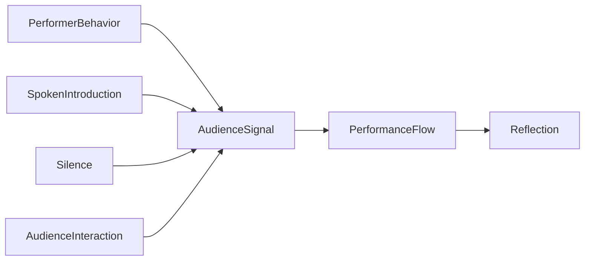
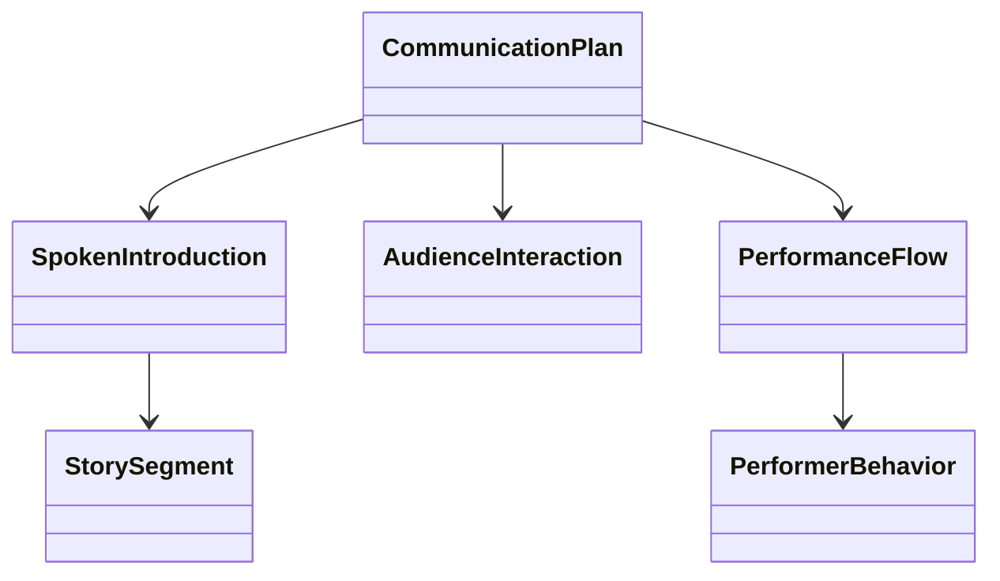

# Chapter 7 — Stage Presence

Stage presence is not acting, charisma, or a personality contest. In this laboratory, stage presence is treated as a deterministic communication system: the audience receives signals before, during, and after every song.

## Learning objectives

By the end of this chapter, you should be able to:

- Describe stage presence as intentional communication.
- Build a `CommunicationPlan` separate from repertoire and arrangement choices.
- Analyze introductions, transitions, silence, audience interaction, and pacing.
- Compare immutable communication experiments without seeking a single score.
- Explain why different communication choices change the audience experience.

## Communication as a system

Every performance communicates through posture, eye contact, facial expression, movement, silence, spoken introductions, transitions, confidence, pacing, and recovery after mistakes. The laboratory does not measure artistic quality. It makes choices visible so you can ask: **What happens when I change how I communicate with the audience?**



## Introductions

A spoken introduction is modeled as structured data with a purpose, estimated duration, emotional tone, audience familiarity, optional story, and transition target. This keeps the question educational: does the introduction fit the available time and prepare the next song?

## Audience interaction

Audience interaction can be as simple as thanking the host, smiling, making eye contact, asking for a refrain, or inviting a clap. The engine analyzes planned interaction as a communication affordance, not as proof that the audience will respond.

## Pacing and silence

Silence is not automatically bad. A breath before a vulnerable song can focus the room. Long unplanned silence between songs, however, can interrupt momentum. Chapter 7 therefore analyzes silence as a timing choice with tradeoffs.

## Storytelling

Stories can build connection, especially before unfamiliar originals. Two long stories in sequence may reduce pacing. The laboratory phrases these as observations rather than rules because the learner may intentionally choose a slower, intimate flow.

## Performance flow

`PerformanceFlow` connects transition smoothness, confidence continuity, eye-contact opportunities, storytelling opportunities, recovery behavior, and silence estimates.



## Executable laboratory

Try:

```bash
open-mic-lab stage analyze
open-mic-lab stage flow
open-mic-lab stage introductions
open-mic-lab stage experiment story
open-mic-lab stage experiment shorten
open-mic-lab stage compare
open-mic-lab chapter-seven-demo
```

The analysis returns a summary, observations, strengths, opportunities, and suggested experiments. It deliberately avoids a single stage-presence score.

## Debug laboratory

Run:

```bash
python -m open_mic_lab.debug_labs.chapter_07_stage_presence
```

Use the VS Code configuration **Debug Chapter 7 Stage Presence Lab**. Breakpoints are marked for communication-plan construction, introduction analysis, pacing evaluation, audience interaction analysis, immutable experiments, and flow comparison.

## Reflection questions

- What did the audience receive before the first note?
- Which introduction helped the song, and which one competed with it?
- Where did silence feel intentional, and where did it feel like uncertainty?
- What communication choice would you test next time?
- How would you recover visibly after a mistake without apologizing for the performance?

## Chapter summary

Chapter 7 expands the laboratory from internal preparation to external communication. Chapters 0–6 helped you choose, arrange, coordinate, and practice material. Chapter 7 asks how those prepared songs meet the room through signals the audience can perceive. Chapter 8 can now introduce the technical performance environment because the learner has modeled both the musical and human sides of live performance.
