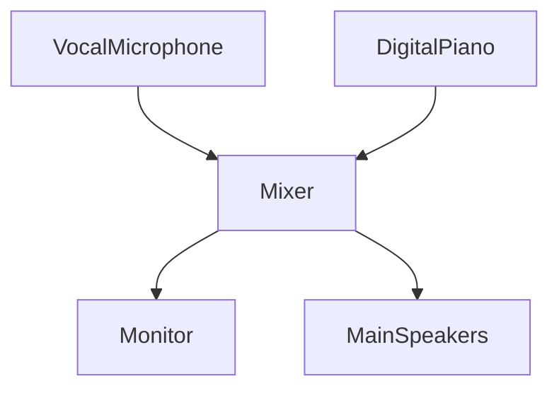
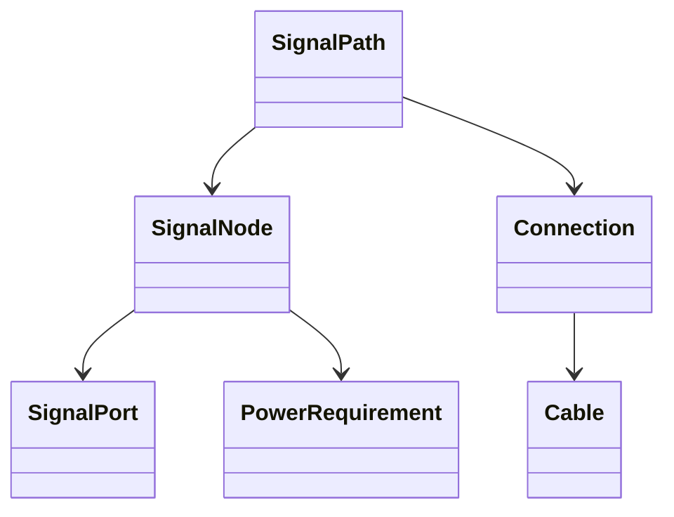

# Chapter 8 — Equipment Laboratory


## Research Foundations

**Research Finding:** This chapter is informed by work on signal flow, microphones, mixers, monitoring, and live-sound engineering practice. **Professional Practice:** It translates those traditions into open-mic decisions that performers and facilitators commonly make. **Educational Heuristic:** Any score, warning, category, or recommendation produced by the laboratory is a repository-designed simplification for comparison and reflection, not a validated predictive model. **Subjective Artistic Judgment:** Learners may reasonably override the model when identity, taste, occasion, or audience relationship matters more than numerical fit.
Every live performance is also a signal-processing system. This chapter does not catalog products; it models relationships between sources, connections, processors, mixers, monitors, and speakers so the learner can ask: **What happens if I change the signal path?**

## Learning objectives

By the end of this chapter, you should be able to:

- Explain sound travel from performer to audience.
- Identify `AudioSource`, `Microphone`, `Pickup`, `InstrumentOutput`, `Cable`, `MixerChannel`, `MonitorMix`, `SpeakerSystem`, and `EffectsProcessor` roles.
- Build deterministic signal-flow diagrams.
- Detect disconnected equipment, missing routes, circular routing, and incompatible signal types.
- Compare immutable equipment experiments safely.

## Signal flow

Signal flow is a directed graph: an output feeds an input through a connection and cable. The laboratory models conceptual signal types such as acoustic, mic level, instrument level, line level, speaker level, headphone level, and digital.



## Component roles

Components expose inputs, outputs, signal type, power requirements, and educational notes. A microphone may produce mic-level signal; a pickup may produce instrument-level signal; a mixer may accept mic or line inputs and create separate main and monitor outputs.



## Common live-performance setups

Educational templates include solo acoustic guitar, solo digital piano, piano and vocal, guitar and vocal, small duo, church service, coffeehouse, open mic, and simple band. These are concept examples, not shopping lists.

## Troubleshooting

Troubleshooting becomes graph inspection:

- If an instrument is not connected, no path can reach the audience.
- If a microphone is not routed, the singer may be present but unheard.
- If a monitor is disconnected, the audience may hear sound while the performer cannot.
- If a cable carries the wrong signal type, level and routing expectations no longer match.

## Validation

The signal-flow engine returns learner-friendly observations for instrument-not-connected, microphone-not-routed, monitor-disconnected, circular-routing, multiple outputs without destinations, missing nodes or ports, and incompatible connection types. Results are structured observations rather than only pass/fail answers.

## Executable laboratory

Try:

```bash
open-mic-lab equipment templates
open-mic-lab equipment analyze
open-mic-lab equipment visualize
open-mic-lab equipment experiment disconnect
open-mic-lab equipment compare
open-mic-lab chapter-eight-demo
```

## Debug laboratory

Run:

```bash
python -m open_mic_lab.debug_labs.chapter_08_signal_flow
```

Use the VS Code configuration **Debug Chapter 8 Signal Flow Lab**. Breakpoints are marked for equipment-template creation, graph construction, routing analysis, validation after a disconnected cable, immutable experiments, visualization generation, and comparison.

## Reflection questions

- Where does sound begin in this setup?
- Which connection reaches the audience?
- Which connection reaches the performer?
- What changed when one cable was disconnected?
- What would you check first if the room cannot hear the vocal?

## Chapter summary

Chapter 8 adds the technical performance environment to the musical and communication systems developed in Chapters 0–7. The learner can now model how sound moves, test changes safely, and prepare for Chapter 9 live sound optimization, where routing choices can become deliberate listening and adjustment strategies.

## References and Further Reading

For the full APA bibliography, see [References](../references.md). Suggested starting points for this chapter: Ballou (2015), Davis and Patronis (2014), Eargle (2012), and Huber and Runstein (2018). These sources motivate the educational concepts; they do not validate the exact deterministic scores used here.
