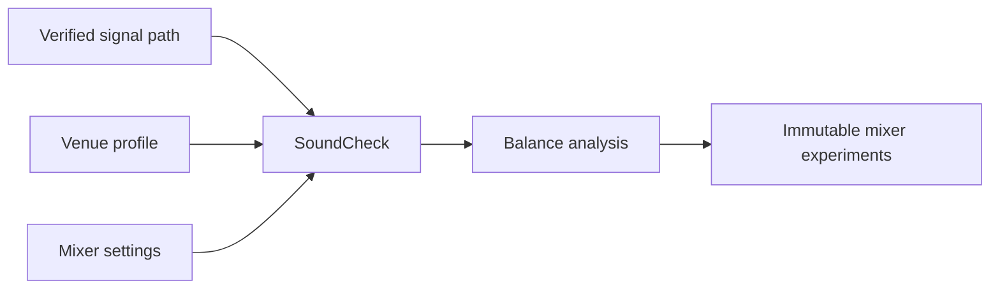
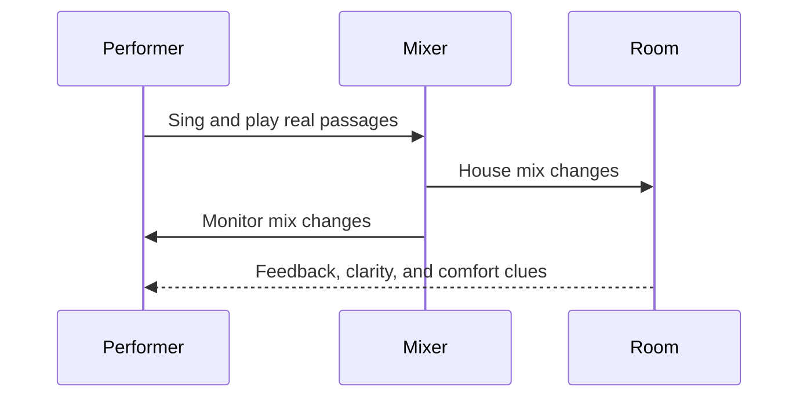

# Chapter 9 — Sound Check Laboratory


## Research Foundations

**Research Finding:** This chapter is informed by work on gain structure, monitoring, feedback control, and sound-reinforcement workflow. **Professional Practice:** It translates those traditions into open-mic decisions that performers and facilitators commonly make. **Educational Heuristic:** Any score, warning, category, or recommendation produced by the laboratory is a repository-designed simplification for comparison and reflection, not a validated predictive model. **Subjective Artistic Judgment:** Learners may reasonably override the model when identity, taste, occasion, or audience relationship matters more than numerical fit.
## Learning objectives

By the end of this chapter, you can perform a structured sound check, explain why a technically correct signal path is only the beginning, compare alternate mixer settings, and describe why different venues require different choices.

## Purpose of a sound check

Chapter 8 asked whether sound can travel from performer to audience and monitor. Chapter 9 asks what happens after the path works. A sound check is a repeatable listening process: verify routing, set levels, balance the house mix, balance monitors, then play real music in the actual room.

## Balancing a mix

The laboratory uses `SoundCheck`, `MixerSettings`, `ChannelSettings`, `EQProfile`, `MonitorMix`, `VenueAcoustics`, `FeedbackRisk`, and `BalanceAssessment`. These are educational approximations. They do not model professional audio engineering or room physics; they make decisions visible.

Typical questions:

- Can listeners understand the lyric?
- Is accompaniment supporting or masking the vocal?
- Is any channel clipping or too quiet to matter?
- Are unused channels intentionally muted?

## Performer monitoring

A monitor mix is for performer comfort, pitch, timing, and confidence. More monitor is not always better: raising it can improve comfort while increasing feedback risk. The engine therefore returns observations, warnings, strengths, and suggested adjustments rather than a single perfect mix.

## Educational acoustics

Venue profiles include quiet coffeehouse, noisy café, church sanctuary, outdoor event, rehearsal room, and community center. Each profile stores coarse values for room size, noise, reflectivity, audience absorption, and monitor sensitivity. These values teach systematic thinking, not measurement.



## Workflow

1. Verify signal path.
2. Check vocal microphone.
3. Check accompaniment.
4. Balance house mix.
5. Balance monitors.
6. Perform a short musical passage.
7. Confirm performer comfort.



## Executable laboratory

Run:

```bash
open-mic-lab soundcheck analyze
open-mic-lab soundcheck workflow
open-mic-lab soundcheck experiment gain ch1 1
open-mic-lab soundcheck experiment monitor 2
open-mic-lab soundcheck compare
open-mic-lab chapter-nine-demo
```

The report is deterministic:

```text
House Mix
Vocals .......... Balanced
Piano ........... Balanced
Monitor ......... Slightly Quiet
Observations
✓ Lyrics have a workable place in the house mix.
⚠ Unused or muted channels should be named intentionally so routing mistakes stand out.
→ Raise monitor level enough for comfort, not for audience volume.
```

## Debug laboratory

Run `python -m open_mic_lab.debug_labs.chapter_09_sound_check` or use **Debug Chapter 9 Sound Check Lab** in VS Code. Breakpoints expose venue loading, workflow generation, mixer analysis, balance calculations, immutable experiments, and comparison of two mixes.

## Reflection questions

- What happens if I change the mix?
- Which adjustment improves the audience mix but makes the performer less comfortable?
- Which venue profile most changes your first decision?
- When would you reduce accompaniment instead of raising the vocal?

## Chapter summary

Sound check completes the technical preparation process begun in Chapter 8. Routing proves the system can work. Sound check teaches how the performer adapts that working system to the room. Chapter 10 can now turn from performer preparation to audience perception.

## References and Further Reading

For the full APA bibliography, see [References](../references.md). Suggested starting points for this chapter: Davis and Patronis (2014), Ballou (2015), Eargle (2012), and Huber and Runstein (2018). These sources motivate the educational concepts; they do not validate the exact deterministic scores used here.
