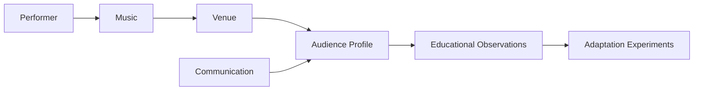

# Chapter 10 — Audience Experience Laboratory

## Learning objectives

By the end of this chapter, learners can compare audience profiles, analyze transparent audience-experience factors, evaluate immutable adaptation experiments, and explain why different audiences may benefit from different performance approaches without predicting emotions or optimizing away artistic authenticity.

## Audience expectations

Different audiences bring different contexts: coffeehouse listeners, church congregations, open mic audiences, listening-room audiences, family gatherings, community festivals, and rehearsal friends may listen with different familiarity, participation, pacing, and storytelling expectations. No audience is homogeneous; the laboratory describes tendencies, not stereotypes.



## Educational heuristics

The audience-response engine studies repertoire familiarity, pacing, communication clarity, variety, transition quality, performance length, participation opportunities, storytelling, and energy progression. The result contains strengths, friction points, adaptation ideas, and explanations. It intentionally does not produce a single audience score.

## Adaptation rather than optimization

The guiding question is: **What happens if I perform the same music for a different audience?** Adaptation can mean moving a familiar song earlier, shortening a story, adding an optional participation moment, simplifying transitions, or changing the closer. The learner remains responsible for authenticity.

## Communication

Chapter 7 modeled stage presence as communication. Chapter 10 asks how that communication may serve a particular audience context. A story may help a listening room orient to an original song and may be too long for a festival walkway. Both observations can be true without ranking either audience.

## Participation

Participation opportunities are modeled as invitations the audience can accept or ignore. The software never assumes people will clap, sing, laugh, or feel a specific emotion.

## Executable laboratory

```bash
open-mic-lab audience profiles
open-mic-lab audience analyze
open-mic-lab audience compare
open-mic-lab audience experiment participation
open-mic-lab audience experiment familiarity
open-mic-lab chapter-ten-demo
```

Example summary:

```text
Audience Experience Summary
Strengths
✓ Strong opening song gives listeners early orientation.
✓ Transitions are clear enough to support pacing.
Observations
• Multiple unfamiliar songs in succession may reduce accessibility.
• storytelling: Stories are treated as context and pacing choices, not proof of connection.
Suggested Experiments
• Replace one unfamiliar song or move a familiar song earlier.
• Shorten one spoken segment.
```

## Debug laboratory

Run:

```bash
python -m open_mic_lab.debug_labs.chapter_10_audience_experience
```

Use the VS Code launch configuration **Debug Chapter 10 Audience Experience Lab**. Breakpoint markers expose audience-profile loading, response analysis, adaptation experiments, comparison of two audience profiles, and immutable experiment behavior.

## Reflection questions

- What changes when this set moves from a coffeehouse to a church congregation?
- Which observation is about familiarity, pacing, communication, or participation rather than artistic quality?
- Which adaptation would preserve your artistic purpose?
- What would you observe after performing without treating the observation as prediction?
- What should remain unchanged because it is central to the performance?

## Chapter summary

Chapter 10 connects the performer, venue, technical sound, stage communication, and audience context into one educational model. It prepares Chapter 11 by making the planned audience experience visible before unexpected events, interruptions, and mistakes disrupt the plan.
