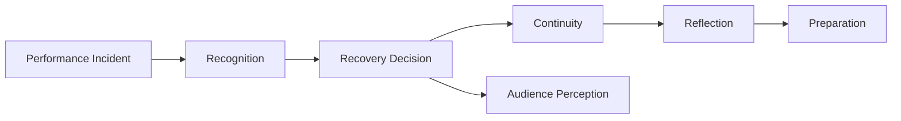
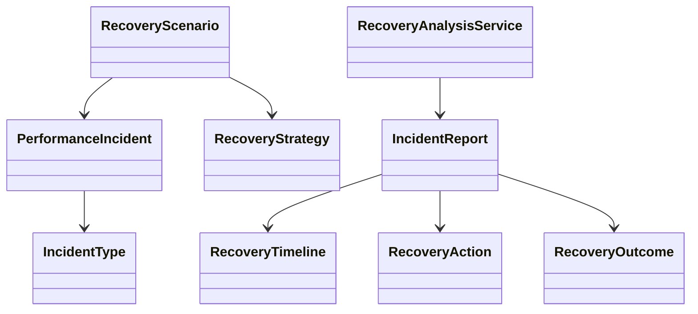
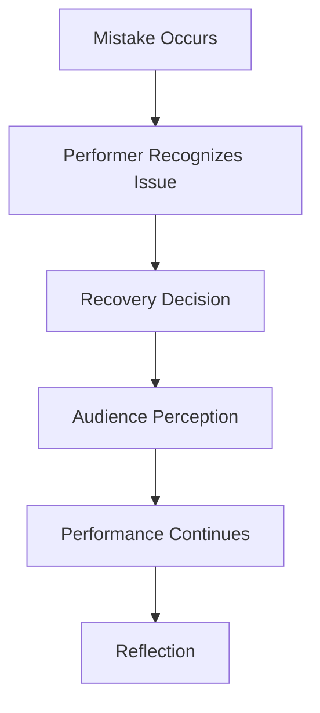

# Chapter 11 — Recovering From Mistakes

## Learning objectives

By the end of this chapter, learners can identify common live-performance incidents, describe recovery as a decision rather than a verdict, compare recovery strategies, inspect a deterministic recovery timeline, and explain why resilience is a critical performance skill.

## Resilience

A mistake is an event. Recovery is a decision. The audience usually experiences the recovery, not just the mistake itself. This laboratory therefore models resilience rather than failure and never evaluates performers with a mistake score.



## Recognizing incidents

`PerformanceIncident` is independent of repertoire and arrangements. The incident catalog includes forgotten lyrics, wrong chord, missed entrance, tempo drift, skipped verse, microphone failure, cable disconnected, broken string, monitor problem, page turn issue, and audience interruption. These are educational scenarios rather than predictions.

## Recovery strategies

Strategies include continuing immediately, restarting a section, simplifying accompaniment, inviting audience participation, skipping a verse, stopping and explaining, instrumental recovery, and tempo reset.



## Communication after mistakes

A calm sentence, steady breath, musical cue, or clear restart can communicate safety. Chapter 7 introduced communication plans; Chapter 11 uses them after surprise. The goal is not to pretend nothing happened. The goal is to decide what helps the shared performance continue.

## Educational tradeoffs

- Continuing confidently may preserve performance flow.
- Restarting may improve musical accuracy but interrupt pacing.
- Simplifying accompaniment reduces coordination demands.
- Audience participation can create a natural recovery opportunity.

These are educational tradeoffs rather than universal rules.

## Executable laboratory

```bash
open-mic-lab recovery incidents
open-mic-lab recovery analyze
open-mic-lab recovery timeline
open-mic-lab recovery experiment continue
open-mic-lab recovery compare
open-mic-lab chapter-eleven-demo
```

## Recovery timeline



The generated `RecoveryTimeline` is deterministic and shows elapsed moments from incident through post-performance reflection.

## Debug laboratory

Run:

```bash
python -m open_mic_lab.debug_labs.chapter_11_recovery
```

Use the VS Code launch configuration **Debug Chapter 11 Recovery Lab**. Breakpoint markers expose incident creation, recovery analysis, immutable experiments, comparison of strategies, and timeline generation.

## Reflection questions

- What did the audience likely experience: the incident, the recovery, or both?
- Which recovery choice protects flow?
- Which recovery choice protects musical clarity?
- What preparation would make the next recovery decision faster?
- How can a performer acknowledge a technical problem without evaluating themselves?

## Chapter summary

Mistakes are inevitable, but performances remain recoverable. Chapter 11 completes the life cycle of an unexpected event: incident detection, recognition, recovery decision, audience perception, continuation, and reflection. Chapter 12 can now build toward adaptive musicianship: changing plans in real time while preserving artistic intention.
