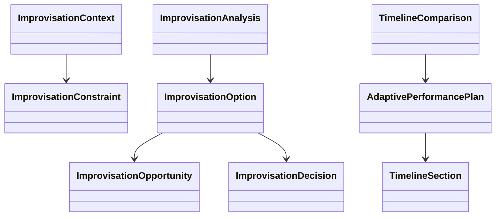

# Chapter 12 — Improvisation Laboratory

## Learning objectives

By the end of this chapter, learners can identify improvisation opportunities, compare adaptive musical decisions, explain how constraints influence choices, inspect an adaptive timeline, and describe improvisation as structured decision-making rather than unrestricted freedom.

## Adaptive performance

The guiding question is: **What happens when the performance cannot follow the original plan?** Improvisation is not the absence of structure. It is making informed musical decisions within constraints.


## Constraints

`ImprovisationConstraint` names remaining time, performer readiness, coordination demands, venue expectations, audience participation, and transition continuity. These constraints influence possible decisions; they do not determine one correct answer.

## Musical decision making

The laboratory models decision points such as extending a section, shortening a section, filling silence, creating introductions, creating endings, varying accompaniment, adapting to audience participation, responding to unexpected events, and creating smooth transitions. It never evaluates artistic originality.

## Improvisation opportunities

`ImprovisationAnalysisService` detects opportunities including extending the ending, shortening the performance, repeating a chorus, adding instrumental space, encouraging audience participation, creating a smoother transition, adjusting dynamics, and finishing early.



## Timeline comparisons

Example comparison:

Planned

- Intro
- Verse
- Chorus
- Bridge
- Chorus
- Ending

Adapted

- Intro
- Verse
- Chorus
- Chorus
- Audience Participation
- Extended Ending

The comparison explains changed duration and inserted or removed sections as educational consequences, not as quality judgments.

## Executable laboratory

```bash
open-mic-lab improv analyze
open-mic-lab improv opportunities
open-mic-lab improv experiment chorus
open-mic-lab improv experiment ending
open-mic-lab improv compare
open-mic-lab chapter-twelve-demo
```

## Debug laboratory

Run:

```bash
python -m open_mic_lab.debug_labs.chapter_12_improvisation
```

Use the VS Code launch configuration **Debug Chapter 12 Improvisation Lab**. Breakpoint markers expose opportunity detection, decision analysis, adaptive timeline generation, immutable improvisation experiments, and comparison of planned and adapted performances.

## Reflection questions

- What changed when the performance could not follow the original plan?
- Which constraints influenced your choice without deciding it for you?
- Which adaptation protected flow?
- Which adaptation protected clarity?
- How could recovery skills from Chapter 11 make adaptive choices calmer?

## Chapter summary

Chapter 12 turns surprise into adaptive musicianship. It builds on recovery strategies from Chapter 11 by showing that unexpected events can become structured musical decisions. It prepares Chapter 13 by preserving artistic freedom while helping learners make transparent choices that begin to reveal their own musical identity.
