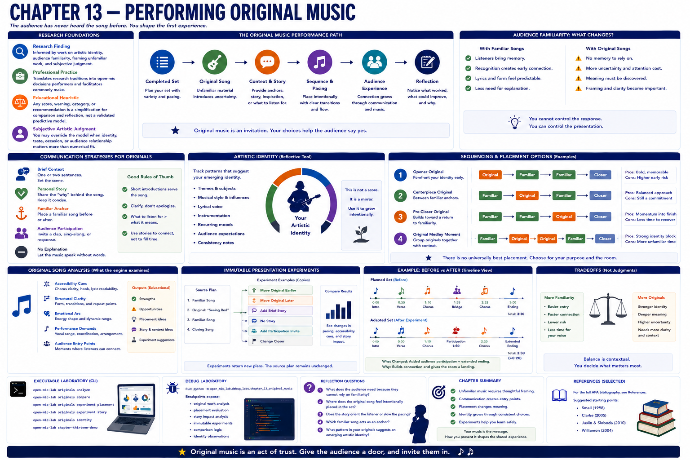
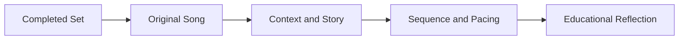
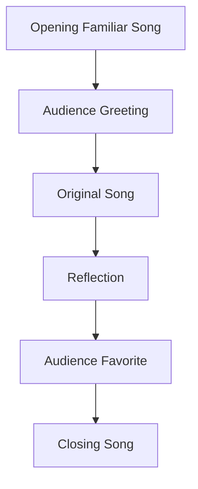

# Chapter 13 — Performing Original Music



## Research Foundations

**Research Finding:** This chapter is informed by work on artistic identity, audience familiarity, framing unfamiliar work, and subjective judgment. **Professional Practice:** It translates those traditions into open-mic decisions that performers and facilitators commonly make. **Educational Heuristic:** Any score, warning, category, or recommendation produced by the laboratory is a repository-designed simplification for comparison and reflection, not a validated predictive model. **Subjective Artistic Judgment:** Learners may reasonably override the model when identity, taste, occasion, or audience relationship matters more than numerical fit.
## Learning objectives

By the end of this chapter, learners can analyze placement of original songs, compare presentation strategies, explain unfamiliar-material tradeoffs, inspect immutable experiments, and describe how communication supports audience connection when the audience has never heard the song before.

## Introducing original music

Original music introduces uncertainty. The laboratory does not teach songwriting and does not judge artistic quality. It asks a performance question: **What happens when the audience has never heard the song before?**



## Audience familiarity

Listeners cannot rely on recognition, so the performer can provide anchors: a familiar song before the original, a concise story, a clear transition, an accessible chorus, or an optional participation moment. These are choices, not guarantees.

## Communication

`SongIntroduction` models timing and strategy: brief context, personal story, familiar anchor, audience participation, or no explanation. The engine explains how spoken framing affects pacing and accessibility.

## Artistic identity

`ArtisticIdentity` records musical themes, recurring styles, audience expectations, and repertoire consistency notes. These concepts are reflective tools rather than measurements of creativity.

## Sequencing

Placement changes meaning. An original opener foregrounds identity early; an original centerpiece can sit between familiar anchors; an original before a familiar closer lets the set return to shared orientation.



## Executable laboratory

```bash
open-mic-lab originals analyze
open-mic-lab originals compare
open-mic-lab originals experiment placement
open-mic-lab originals experiment story
open-mic-lab originals identity
open-mic-lab chapter-thirteen-demo
```

## Debug laboratory

Run:

```bash
python -m open_mic_lab.debug_labs.chapter_13_original_music
```

Use VS Code launch configuration **Debug Chapter 13 Original Music Lab**. Breakpoint markers expose original-work analysis, placement evaluation, immutable presentation experiments, comparison of plans, and artistic-identity observations.

## Reflection questions

- What does the audience need because they cannot rely on familiarity?
- Where does the original song feel intentionally placed?
- Does the story orient the listener or slow the pacing?
- Which familiar song acts as an anchor?
- What pattern in your originals suggests an emerging artistic identity?

## Chapter summary

Chapter 13 helps learners present original work thoughtfully without predicting success or evaluating creativity. It prepares Chapter 14, the complete Open Mic Simulator, by connecting repertoire, set building, arrangement, communication, audience experience, recovery, and improvisation around a learner's own artistic identity.

## References and Further Reading

For the full APA bibliography, see [References](../references.md). Suggested starting points for this chapter: Small (1998), Clarke (2005), Juslin and Sloboda (2010), and Williamon (2004). These sources motivate the educational concepts; they do not validate the exact deterministic scores used here.
