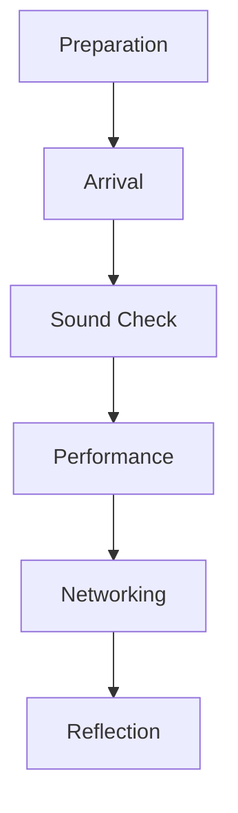
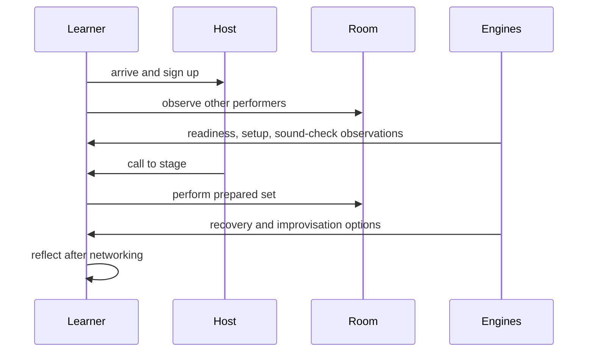

# Chapter 14 — Open Mic Simulator

Chapter 14 is the Volume I capstone. It asks: **what happens during an entire open mic from arrival to reflection?** The simulator is an educational example, not a predictive model of venues, audiences, or success.

## Learning objectives

- Simulate a full evening: preparation, arrival, waiting, sound check, performance, networking, and reflection.
- Observe how Chapters 0–13 contribute to one event.
- Compare deterministic scenarios without ranking the performer.
- Run immutable event experiments and preserve the original event.

## Event orchestration

The orchestration layer introduces `OpenMicEvent`, `PerformerArrival`, `SignUpOrder`, `WaitingPeriod`, `PerformanceSlot`, `PerformanceExecution`, `NetworkingOpportunity`, `PostPerformanceReflection`, and `EventTimeline`. These models describe the evening; they do not reimplement the analytical engines.



## Preparation

The simulator reuses repertoire, set construction, readiness, arrangement, coordination, communication, equipment, and sound-check services. Preparation becomes visible as a set of concrete choices: which songs, which arrangement, which equipment path, and which communication plan.

## Execution

During execution, the event uses the planned set and integrates recovery and improvisation opportunities. A recovery incident is treated as an educational scenario, and improvisation is constrained decision-making rather than random invention.



## Reflection

The event report gathers preparation, repertoire, arrangement choices, communication, equipment setup, sound-check observations, audience observations, recovery events, improvisation opportunities, original-song placement, and reflection prompts.

## Subsystem integration

Chapter 14 composes previous systems:

- Chapters 0–3: readiness, repertoire, suitability, and set building.
- Chapters 4–7: arrangements, coordination, practice, and communication.
- Chapters 8–10: equipment, sound check, and audience experience.
- Chapters 11–13: recovery, improvisation, and original music.

## Executable laboratory

Run:

```bash
open-mic-lab event simulate
open-mic-lab event timeline
open-mic-lab event compare
open-mic-lab event experiment unexpected-recovery-event
open-mic-lab event report
open-mic-lab chapter-fourteen-demo
```

## Debug laboratory

Run:

```bash
python -m open_mic_lab.debug_labs.chapter_14_open_mic
```

Breakpoint markers show event creation, orchestration, subsystem interaction, immutable experiments, and report generation.

## Reflection questions

- Which preparation choice most influenced the simulated performance?
- What did waiting and observation reveal before playing?
- Which subsystem produced the most surprising learning prompt?
- What should Chapter 15 explore after the full Volume I capstone?

## Chapter summary

The Open Mic Simulator completes Volume I by turning isolated laboratories into one deterministic educational evening. It preserves each subsystem and adds an orchestration layer that lets learners inspect how preparation influences performance.
