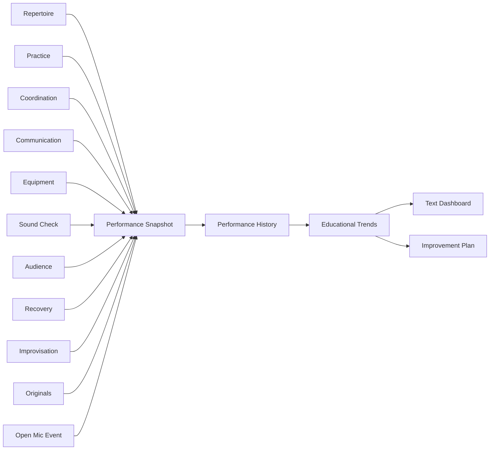

# Chapter 15 — Performance Analytics & Continuous Improvement


## Research Foundations

**Research Finding:** This chapter is informed by work on reflection, feedback, continuous improvement, and self-regulated learning. **Professional Practice:** It translates those traditions into open-mic decisions that performers and facilitators commonly make. **Educational Heuristic:** Any score, warning, category, or recommendation produced by the laboratory is a repository-designed simplification for comparison and reflection, not a validated predictive model. **Subjective Artistic Judgment:** Learners may reasonably override the model when identity, taste, occasion, or audience relationship matters more than numerical fit.
## Learning objectives

- Aggregate multiple performances into a `PerformanceHistory`.
- Generate educational trends without assigning artistic worth.
- Read a deterministic text dashboard and ask what to improve next.
- Create immutable `ImprovementPlan` experiments.
- Trace evidence from Volume I subsystems into transparent recommendations.

## Continuous improvement

Every performance creates information. Chapter 15 closes the Volume I feedback loop by turning observations into hypotheses for the next rehearsal cycle. The guiding question is: **What should I improve before my next performance?**

The analytics engine summarizes observations across performances. It does not rank performers, predict audience approval, or evaluate artistic value.

## Analytics model

Reusable domain objects include `PerformanceSnapshot`, `PerformanceHistory`, `TrendObservation`, `PracticeTrend`, `RepertoireTrend`, `ImprovementRecommendation`, `PerformanceDashboard`, and `ImprovementPlan`.



## Educational trends

Reports include readiness over time, practice distribution, repertoire expansion, audience observations, common recovery scenarios, coordination improvements, original-song integration, and event summaries. These are educational summaries: they reveal patterns and tradeoffs rather than success or failure.

## Dashboard

The dashboard is text-only in Volume I:

```text
Performance Dashboard
Readiness
█████████░
Repertoire Diversity
█████████░
Practice Consistency
████████░░
Communication
████████░░
Technical Preparation
██████████
Recovery Confidence
████████░░
```

## Improvement planning

Recommendations explain why they are generated. Examples include practicing developing songs, expanding genre balance, rehearsing transitions, improving monitor setup consistency, introducing an additional original song, and strengthening closing repertoire.

Immutable experiments create copied plans:

- emphasize practice
- emphasize new repertoire
- emphasize communication
- prepare for upcoming performance
- technical focus month
- maintenance month

## Executable laboratory

```bash
open-mic-lab analytics dashboard
open-mic-lab analytics trends
open-mic-lab analytics recommendations
open-mic-lab analytics compare
open-mic-lab analytics improvement-plan
open-mic-lab chapter-fifteen-demo
```

The demo loads simulated performances, aggregates history, displays trends, generates recommendations, compares plans, demonstrates immutable experiments, and concludes with a Volume I summary.

## Debug laboratory

Run:

```bash
python -m open_mic_lab.debug_labs.chapter_15_performance_analytics
```

Use VS Code launch configuration **Debug Chapter 15 Performance Analytics Lab**. Breakpoint markers expose history aggregation, analytics generation, recommendation generation, dashboard creation, and immutable planning experiments.

## Reflection questions

1. Which observation appears repeatedly across performances?
2. Which recommendation is most useful before the next specific venue?
3. Which trend might be misleading without learner reflection?
4. How did one earlier chapter contribute evidence to the final plan?
5. What experiment would you run for the next month?

## Chapter summary

Chapter 15 completes Volume I by converting individual performances into long-term learning. The learner can now choose songs, engineer repertoire, build sets, revise arrangements, practice deliberately, coordinate voice and accompaniment, communicate with an audience, prepare equipment, run sound checks, observe audience experience, recover from mistakes, improvise, present original music, simulate an open mic, and transform the resulting information into next actions.

## Volume I summary

Volume I is a complete deterministic executable textbook for open mic preparation and reflection. It preserves an educational philosophy: models support observation, comparison, debugging, and planning; they never judge artistic worth. Future volumes may extend persistence, richer interfaces, or media analysis, but those extensions are not implemented here.

## References and Further Reading

For the full APA bibliography, see [References](../references.md). Suggested starting points for this chapter: Schön (1983), Hattie and Timperley (2007), Zimmerman (2002), and McPherson and Zimmerman (2002). These sources motivate the educational concepts; they do not validate the exact deterministic scores used here.
