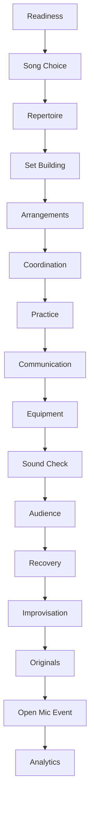

# Volume I Overview

Volume I guides a learner from first motivation through repeated live performances and continuous improvement.

## Educational philosophy

The laboratory is deterministic, transparent, and learner-centered. Scores are educational summaries, not measurements of talent or artistic worth. Every recommendation includes a reason so learners can accept, reject, or revise it.

## Subsystem architecture

Core packages remain stable: `domain` contains immutable educational concepts, `services` contain deterministic calculations, `sample_data` provides repeatable examples, `cli` exposes laboratories, and `debug_labs` supports step-through learning.

## Chapter progression

Chapters 0–15 are implemented. The capstone, Chapter 15, connects repertoire, readiness, arrangements, practice, coordination, communication, equipment, sound check, audience observations, recovery, improvisation, original music, and event summaries into continuous improvement.

## Deterministic simulation approach

The repository uses fictional/public-domain-style data and deterministic calculations so examples, tests, CLI output, and debugging sessions are repeatable.

## Debugging workflow

Each debug lab rebuilds sample data from a known baseline. Launch configurations make it possible to inspect variables at documented breakpoint markers without network access or hidden state.

## Future extension points

Possible future extensions include persistence, richer dashboards, notebooks, media integrations, or AI-assisted reflection. They are intentionally not part of the completed Volume I implementation.
